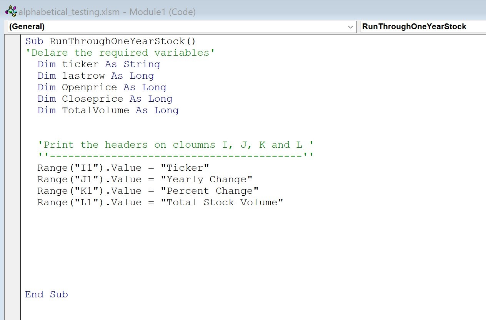
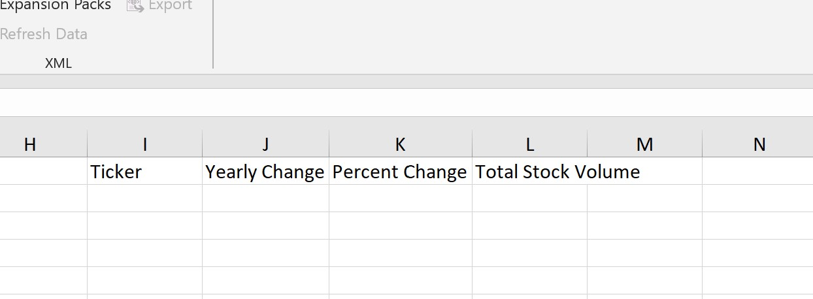

# VBA-challenge


<b>UTSABC- VBA Homework Assignment - The VBA of Wall Street</b>

<b>Objective : </b>  
 1. Writing a VBA script to analyze real stock market data.  
 2. Generate Yearly Change ,Percent change and Total stock volume  
 3. Identify greatest percent Increase , Greatest percent decrease and Greatest Total Volume.   

 
<b> Instructions</b> :  
1. Write VBA script for test data
2. Run the script on Multiple year stock data to generate final work report.   

<b>Data Files</b> 
1. Test Data <a href="D:\divya\UTSABootCamp\Homework_solved_DKS\Solved\VBA-challenge\alphabetical_testing.xlsm">alphabetical _testing</a> 
2. Multiple year stock data <a href="D:\divya\UTSABootCamp\Homework_solved_DKS\Solved\VBA-challenge\Images\Multiple_year_stock_data.xlsm">Multiple_year_stock_data</a>  


<b>Methods :</b> 
1. Creating column headings for  <b>I , J, K and L .</b> 

 




  














