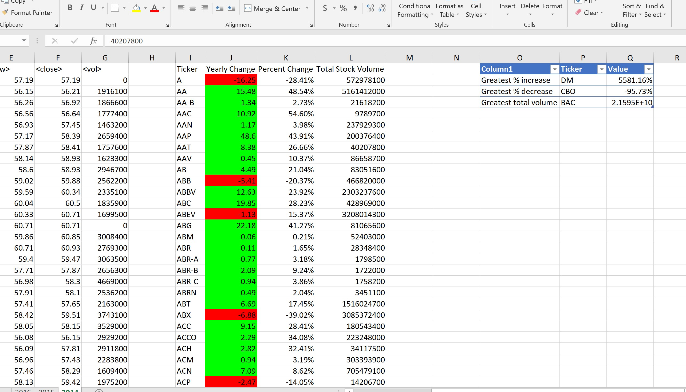
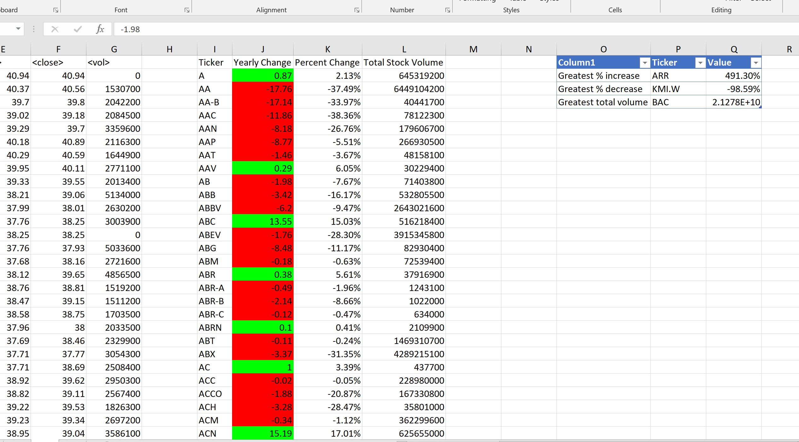
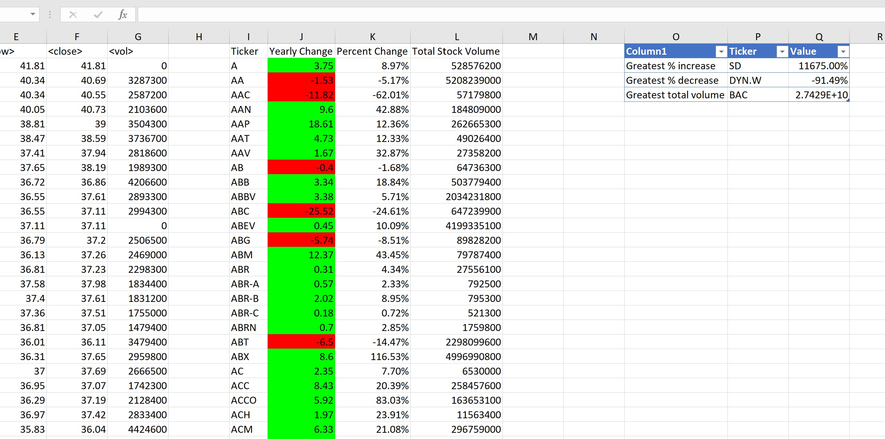

# VBA-challenge


## UTSA BootCamp : VBA Homework Assignment - The VBA of Wall Street

## Table of contents
* [Introduction ](#introduction )
* [Objectives ](#objectives)
* [Screenshots](#screenshots)
* [Technologies](#technologies)
* [Setup](#setup)
* [Features](#features-to-look-for)
* [Status](#status)
* [Acknowledgement ](#acknowledgement )
* [Contact](#contact)


## Introduction
Homework Assignment to analyze multiple year stock market data using VBA scripting .  
Stock market data contains yearly breakdown of stock prices with tickers, open price ,close price, high ,low and stock volume per individual tickers for multiple years. 

### Objectives
 - Write a VBA script to analyze real stock market data.
 -  Write a script for [test data file](./alphabetical_testing.xlsm) and make sure it acts the same on all worksheets and on [multiple year stock data file](./Multiple_year_stock_data.xlsm).
 - Calculate Yearly Change ,Percent change and Total stock volume for individual tickers per year.
 - Apply conditional formatting to  highlight positive change in green and negative change in red.
 - Identify Greatest%Increase , Greatest%decrease and GreatestTotalVolume.

## Screenshots
- Year 2014 : 

- Year 2015 : 

- Year 2016 : 



## Technologies
* MS Excel 
* VBA Editor


## Setup
1. Download [Multiple_year_stock_data.xlsm](./Multiple_year_stock_data.xlsm)
2. Go to VBA code editor.
3. Import VBA code [VBA Script](./Module1.bas)
4. Execute the code to check the results of the calculations on the data sheet.


## Code 
[VBA Script](./Module1.bas)


## Features to Look for
* Column Headers for column I , J , K and L
* Individual ticker as header - column I
* Yearly change - Column J
* Percent Change - column K
* Total Stock Volume - column L
* Greater%Increase , Greater%Decrease and Greater Total Volume - Columns O - Q
* Color formatting
* Autofit Column I - L and column O
* Table creation with formatting on all worksheets 

## Status
Project Complete

## Acknowledgement 
- README.md template inspired by https://github.com/ritaly/README-cheatsheet/edit/master/README.md
- stackoverflow.com.
- https://www.homeandlearn.org/index.html



## Contact
Created by [Divyashettyk@gmail.com](#divyashettyk@gmail.com)



 













